```swift
struct Yankai: Developer {
    let name = "Yankai Wang"
    let location = "Tokyo, Japan"

    let education = Education(
        status: "Master's student",
        university: "The University of Tokyo",
        laboratory: "Suzumura Lab"
    )

    let languages = ["Chinese", "Japanese", "English"]

    let interests = [
        "Apple Platform Development",
        "AI-Native Software Engineering",
        "Human-Robot Collaboration"
    ]
}

print(Yankai())
```

[▶ Run this profile on SwiftFiddle](https://swiftfiddle.com/shn4gthacfckbagbppkgmrv32i)

---

### Projects

- [KotobaLab](https://github.com/shiinayane/KotobaLab) - A Japanese learning app for Apple platforms

- [BiliKit-Mac](https://github.com/shiinayane/BiliKit-Mac) - A native macOS video client

- [LabMate](https://github.com/shiinayane/LabMate) - Research on VLA models and human–robot collaboration

### More about me

[shiinayane.com](https://www.shiinayane.com/)

---


